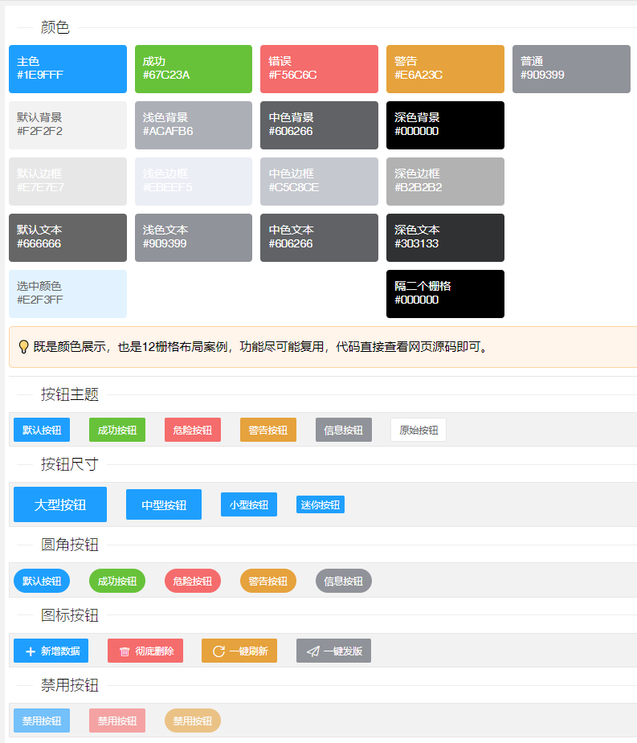

## EOVA
🔥一个基于jfinal的国产低代码开发平台，我们坚持NO Spring原则，追求极简。 近期将会更新全新的开源版本EovaMeta，有兴趣的可以关注本项目。

## 全新UI秘密研发中

## 欢迎加群围观EovaMeta研发进展

## Eova官方社群
- 有问题不用怕，社区问答来帮你：[快速提问](http://www.eova.cn/qa)

## 为少走弯路而看文档
- [Eova技能书](http://doc.eova.cn)

Eova效果展示：
------------------------

* [做网站后台管理，就用EOVA快速开发](http://www.eova.cn) 简单才是高科技，因为简单所以更快，降低70%开发成本
* 其它疑问请上社区提问！https://eova.cn